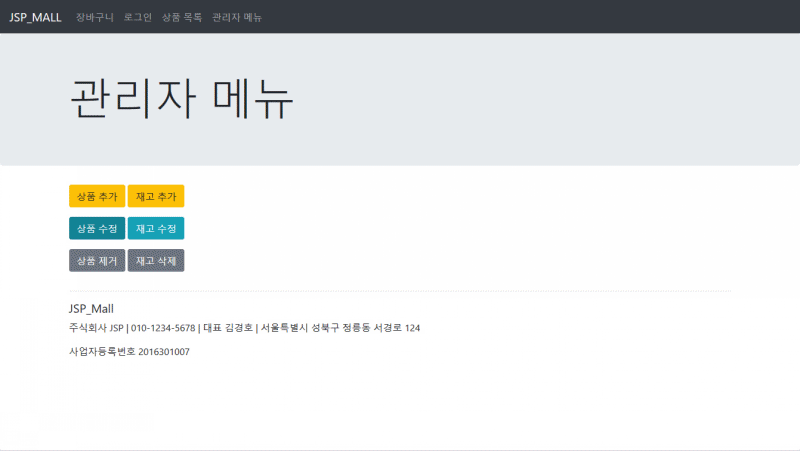
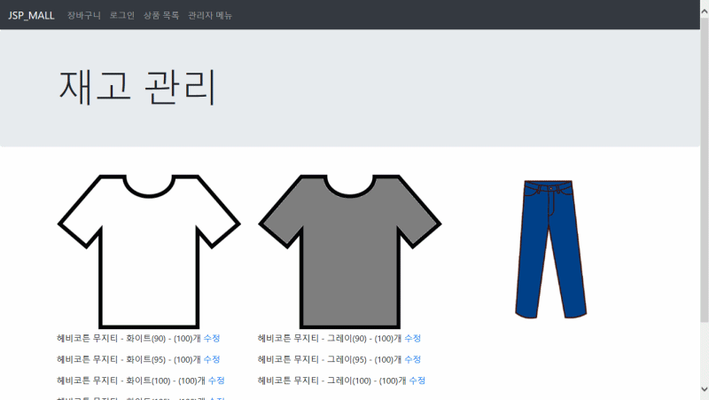
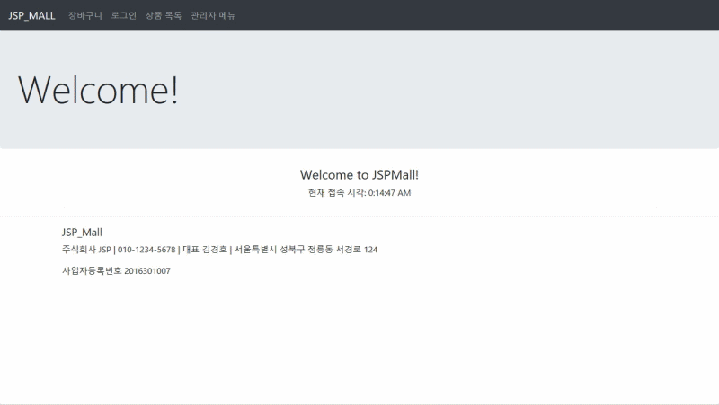
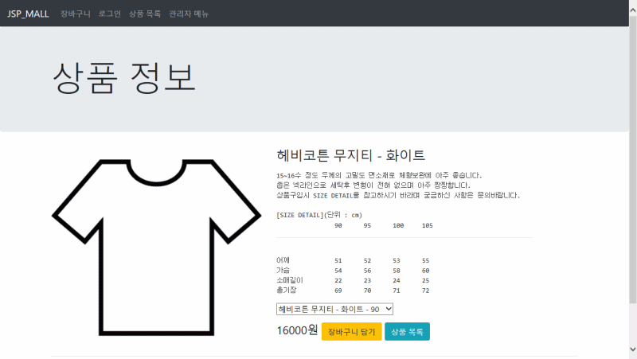
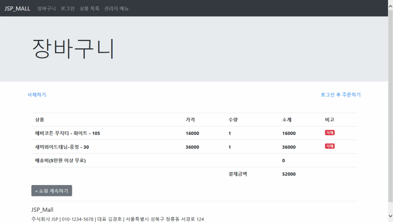
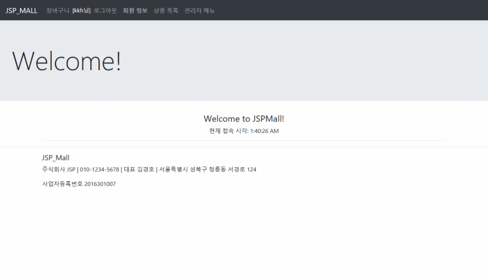
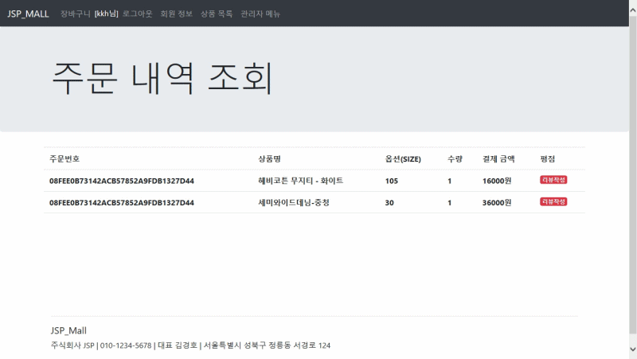

# -project-JSP_Mall
3학년 1학기 '웹서버컴퓨팅' 기말 프로젝트

# <소개>
- JSP(JavaServer Pages) 쇼핑몰 프로젝트
- 데이터베이스를 연동하여, 회원, 상품, 재고의 CRUD 구현
- 쿠키를 이용한 장바구니 구현

  ## 상품
    
    
    - 상품과 재고를 관리하기 위해 관리자 로그인 필요
    ### 상품 - 추가
    
    
    - 관리자 로그인후 상품 추가 가능
    ### 상품 - 수정
    
    
    - 관리자 로그인후 상품 수정 가능
    ### 상품 - 삭제
  ## 재고
    ### 재고 - 추가
    
    
    - 관리자 로그인후 재고 추가 가능
    
    ### 재고 - 수정
    
    
    - 관리자 로그인후 재고 수정 가능
    ### 재고 - 삭제
  ## 회원
    ### 회원 - 등록
    
    
    ### 회원 - 수정
    
    
    ### 회원 - 탈퇴
   
  ## 주문
    ### 장바구니
    
    
    ### 결제
    
    
    ### 주문정보
    
    
    ### 평가
    
    
  
  
## <개발환경>
- IDE : Eclipse
- Hardware : AMD RYZEN 2200G(4core) RAM 8GB

## <개발기간>
- 2021년 6월(1주)
