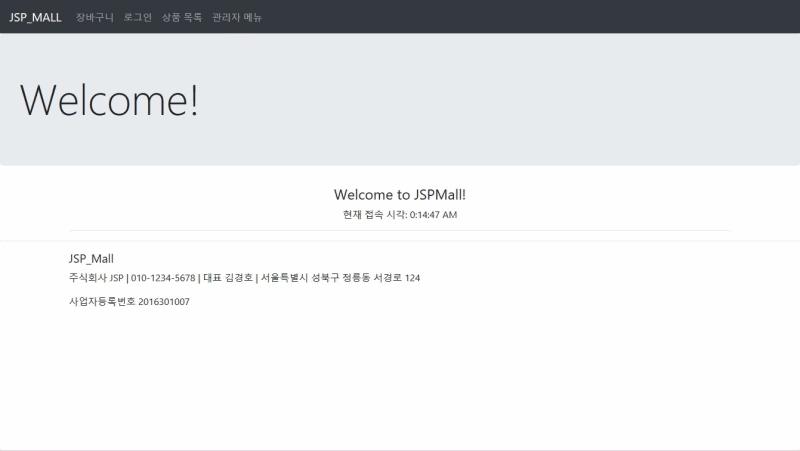

# -project-JSP_Mall
3학년 1학기 '웹서버컴퓨팅' 기말 프로젝트

# <소개>
- JSP(JavaServer Pages) 쇼핑몰 프로젝트
- 데이터베이스를 연동하여, 회원, 상품, 재고의 CRUD 구현
- 쿠키를 이용한 장바구니 구현

  ## 상품
    
    - 상품과 재고를 관리하기 위해 관리자 로그인 필요
    ### 추가
    ### 수정
    ### 삭제
  ## 재고
    ### 추가
    ### 수정
    ### 삭제
  ## 회원
    ### 추가
    ### 수정
    ### 삭제
   
  ## 주문
  
  
  
## <개발환경>
- IDE : Eclipse
- Hardware : AMD 2200G(4core), RAM 8GB

## <개발기간>
- 2021년 6월(1주)
